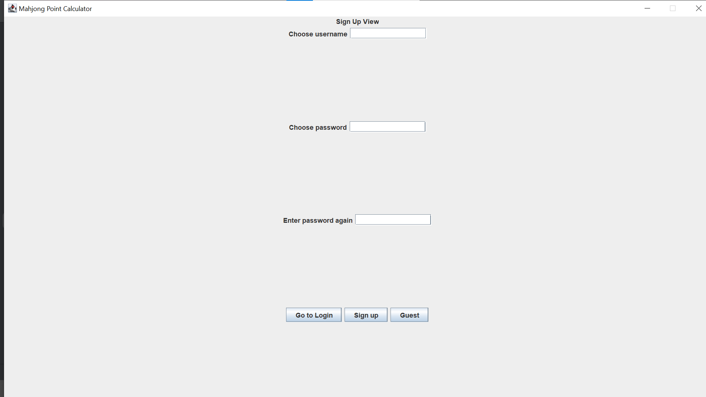
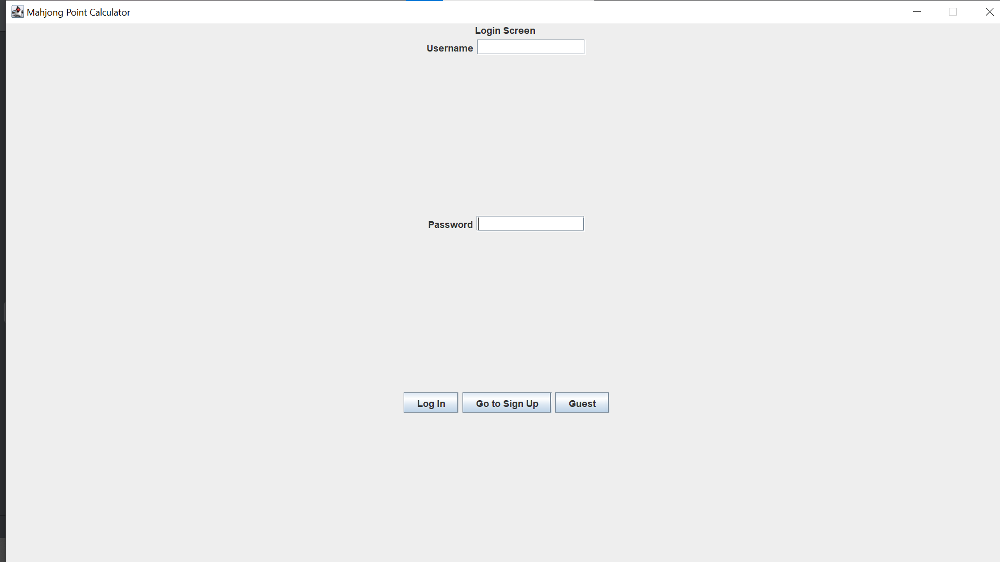
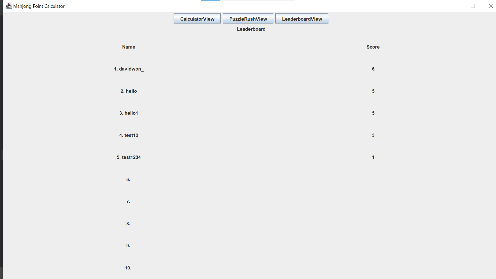

# CSC207 - Mahjong Score Trainer

A simple Mahjong Score Trainer that includes a score calculator, a training mode, and a puzzle rush mode.

## Overview

There are 3 main views this program will have: a **Point Calculator**, a **Puzzle Rush**, and the **Leaderboard**. In the Point Calculator mode, users are given a UI in which they will input a Mahjong Hand and the program will output the score that the hand is worth. In the Puzzle Rush mode, users are given a time limit and are tasked with inputting as many scores as they can. Once done, the number of hands they scored are tallied and they will be shown a leaderboard on how they compare to other users.

## Group Members

| Name           | Github Username | Git Usernames (if different) |
|----------------|-----------------|------------------------------|
| Christopher Li | ChristopherLi05 | a, Christopher Li            |
| Fuma Kano      | fumak208        |                              |
| David Won      | david-703       |                              |
| Hiro Yano      | Hiro2974        |                              |
| Max Chen       | MaxChen102      |                              |

## User Stories

#### Group User Story
- As a user, I want to be able to practice scoring hands under time pressure, so I can calculate hand value faster.

#### Christopher User Story
- As a user, I want to be able to see the maximum number of hands that were scored during the Puzzle Rush mode, so I can set a goal for myself to achieve

#### Fuma User Story
- As a user, I want to be able to create an account to keep track of my progress, so I can keep track of my progress

#### David User Story
- As a user, I want to be able to click on tiles to add to the calculator

#### Hiro User Story
- As a user, I want to be able to calculate how much my mahjong hand is worth, so I can receive a correct amount of points

#### Max User Story
- As a user, I want to be able to login to my account, so I can keep track of my progress

## Features

### Signing Up

To sign up, you must choose a username that does not already exist. Next enter your password twice and click the "Sign up" button to create your account!

### Logging In

Once your account is created, you will be taken to the login screen. Simply re-enter your username and password and click the "Log in" button to login. 
You are also able to go back to the signup screen to create another account.
Guest login is also possible but your scores will not be stored.

### Mahjong Point Calculator

Upon logging in, you will be taken to the calculator.
Here you are able to input any hand by clicking on the tiles, and click the "calculate" button to get your score.
There is also a tab switcher on top to take you to other modes, puzzle rush and the leaderboard.

### Puzzle Rush

After clicking "start" in the puzzle rush mode, a timer goes off.
You are asked to input the correct amount of points of the Mahjong hand presented to you, if your answer is correct, you will be given another hand.

### Leaderboard

In the leaderboard, you are able to see the top scores and the username of the players who achieved those scores.

## Suggestions and Feedback

